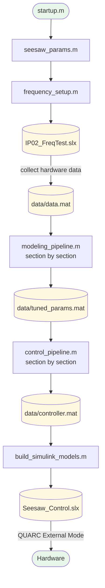
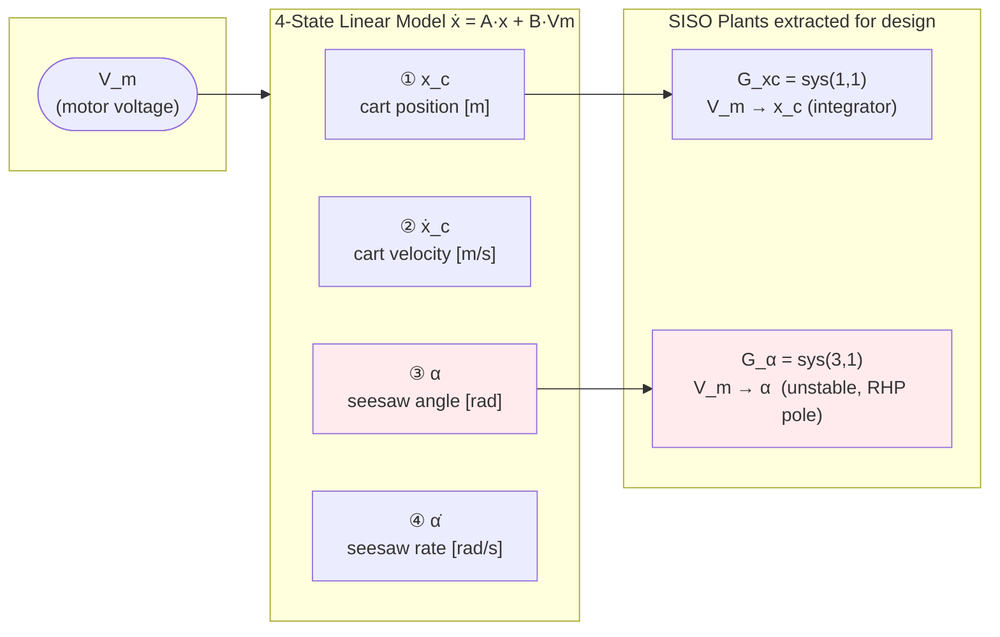
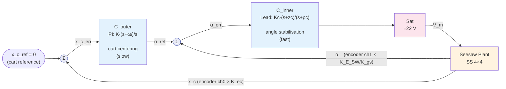
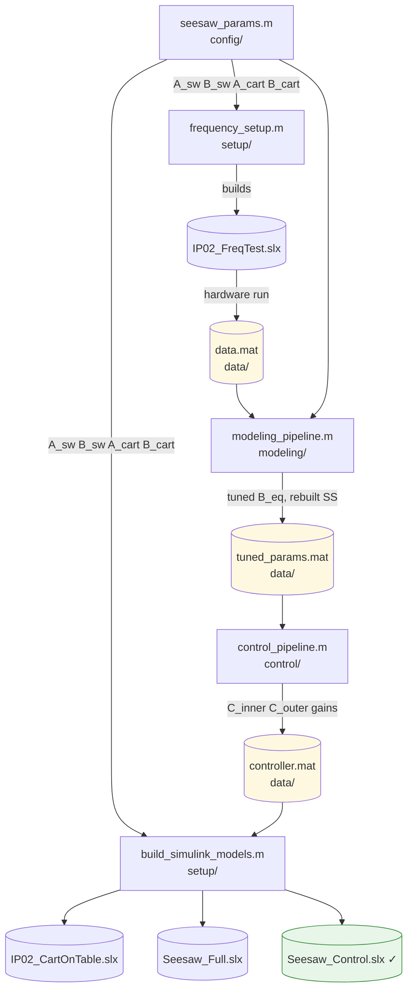

# Quanser IP02 + SEESAW-E — MATLAB/QUARC Project

This repo models, identifies, and controls the Quanser IP02 cart + SEESAW-E seesaw system.
The workflow has three phases: **modeling → system identification → control**.

---

## Quick Start

Run this every time you open MATLAB before doing anything else:

```matlab
>> startup        % adds all folders to path, sets SEESAW_ROOT
>> seesaw_params  % loads all hardware constants and builds state-space matrices
```

---

## The Pipeline



The two pipeline scripts (`modeling_pipeline.m` and `control_pipeline.m`) are
written **section by section** — run each `%%` block with `Ctrl+Enter` and read
the console output before moving to the next.

---

## Physical System

```
        Motor                    Pivot
          │                        │
    ┌─────▼──────────────────────┐ │
    │  ←──── rack & pinion ────► │ │       ← Cart slides along the plank
    │          CART               │◄┤
    │       M_c = 0.38 kg        │ │       ← Plank tilts about pivot
    └────────────────────────────┘ │
                                   │
              D_T = 0.125 m ───────┤
              D_C = 0.058 m ──── CoG

    Plank mass M_SW = 3.6 kg
    Max tilt ±11.5° (hard stops)
```

**Why it's unstable:** when the seesaw tilts, gravity accelerates the cart *further*
in the same direction — positive feedback. The linearised model has a right-half-plane
pole at ≈ +2.15 rad/s. The cart also has a free-drift integrator (no restoring force
at zero angle). Both must be handled by the controller.

---

## State-Space Model



> **Critical:** output index `3` = alpha, NOT `2`. Our state ordering
> `[x_c, ẋ_c, α, α̇]` differs from the Quanser reference manual
> `[x_c, θ, ẋ_c, θ̇]`. Using the wrong index extracts the wrong signal silently.

---

## Control Architecture



**Design rationale:**

| Loop | Compensator | Target crossover | Key constraint |
|------|-------------|-----------------|----------------|
| Inner | Lead `Kc(s+zc)/(s+pc)` | `ωc ≈ 5.5 × p_u` | Must cross over before RHP pole destabilises |
| Outer | PI `K(s+ωi)/s` | `ωc_outer = ωc / 10` | Must be 10× slower than inner (cascade separation) |

**Nyquist requirement:** `G_α` has 1 open-loop RHP pole (P=1) → the loop gain
`L(s) = C_inner · G_α` must make exactly **1 counter-clockwise encirclement of −1**.
Standard gain/phase margins apply as usual once this is satisfied.

---

## Key Technical Facts

| Item | Value | Notes |
|------|-------|-------|
| **State ordering** | `[x_c, ẋ_c, α, α̇]` | Differs from Quanser ref `[x_c, θ, ẋ_c, θ̇]` |
| **Cart encoder gain** | `K_ec = 2.275e-5 m/count` | Already a *linear* conversion — do not multiply by `r_pp` again |
| **Seesaw encoder gain** | `K_E_SW / K_gs` rad/count | Gear ratio K_gs = 3 between pivot and encoder shaft |
| **Tuned parameter** | `B_eq` only | Cart friction [N·s/m]; `eta_g` fixed at 0.90 (hardware spec) |
| **Motor model** | Reduced (`L_m = 0`) | `L_m/R_m = 69 µs` — negligible vs mechanical time constants |
| **Back-EMF damping** | Embedded in `F_c` | Not added to `B_eq`; `B_total = B_eq + B_emf` |
| **Voltage limit** | ±22 V | VoltPAQ-X1 hard saturation; enforced in every model |

---

## File Map



---

## Scripts

### `startup.m` (root)

Run first. Adds `data/`, `docs/`, `models/`, `scripts/`, `src/` to the MATLAB
path recursively and sets `SEESAW_ROOT` in the base workspace (scripts use this
to locate files without hardcoded paths).

---

### `scripts/config/`

**`seesaw_params.m`** — Central parameter hub. Must be run before anything else.

- All hardware constants from Quanser manuals (masses, motor, gearbox, encoders, geometry)
- Computes `J_pivot`, `alpha_f`, `B_emf`, `B_total`
- Builds Phase 1 SS matrices (`A_cart`, `B_cart`, `C_cart`, `D_cart`) — 2-state cart only
- Builds Phase 2 SS matrices (`A_sw`, `B_sw`, `C_sw`, `D_sw`) — 4-state coupled seesaw
- Prints eigenvalues; warns if unstable (expected for the full seesaw)

---

### `scripts/setup/`

**`frequency_setup.m`** — Builds `IP02_FreqTest.slx`.

Chirp (swept-sine) excitation model for system identification. Logs motor voltage
and encoder data to `data/data.mat`. Called automatically by Section 3 of
`modeling_pipeline.m`, but can be run standalone.

**`build_simulink_models.m`** — Builds all three Simulink models from MATLAB code.

| Phase | Model | Purpose |
|-------|-------|---------|
| 1 | `IP02_CartOnTable.slx` | Cart-only open-loop (table-top ID) |
| 2 | `Seesaw_Full.slx` | Full seesaw open-loop (FRF collection) |
| 3 | `Seesaw_Control.slx` | **Closed-loop cascade controller** ← deploy this |

Phase 3 skips automatically if `controller.mat` does not exist. With QUARC
detected: adds HIL Initialize, HIL Write Analog, HIL Read Encoder blocks.
Without QUARC: builds a simulation-only plant-in-loop variant for testing.

---

### `scripts/modeling/`

**`modeling_pipeline.m`** — Master system identification notebook. Run section by section.

| § | What it does |
|---|-------------|
| 1 | Load `seesaw_params` |
| 2 | Analytical Bode plot of untuned model |
| 3 | Build `IP02_FreqTest.slx` via `frequency_setup.m` |
| 4 | Load & sanity-check `data/data.mat` |
| 5 | Overlay untuned FRF vs hardware (Welch H1 estimator) |
| 6 | Auto-tune `B_eq` — single-variable `fminsearch`, `eta_g` locked at 0.90 |
| 7 | Rebuild `A_cart` / `A_sw` with tuned `B_eq` |
| 8 | FRF overlay tuned vs hardware (should match) |
| 9 | Time-domain `lsim` vs hardware overlay |
| 10 | Save `data/tuned_params.mat` |

**`cart_on_table_model.m`** — Standalone Phase 1 nonlinear ODE sim (`ode45`). Reference only.

**`seesaw_nonlinear_model.m`** — Standalone full seesaw nonlinear ODE sim. Quantifies
linearisation error. Reference only.

---

### `scripts/analysis/`

**`frequency_analysis.m`** — Standalone `B_eq` autotuner. Superseded by §6–8 of
`modeling_pipeline.m`; kept as a reference tool.

**`validate_against_hardware.m`** — Standalone time-domain overlay. Superseded by
§9 of `modeling_pipeline.m`; kept as a reference tool.

---

### `scripts/control/`

**`control_pipeline.m`** — Classical frequency-domain controller design. Requires
`data/tuned_params.mat`. Run section by section.

| § | What it does |
|---|-------------|
| 1 | Load tuned model; override `B_eq` from `tuned_params.mat` |
| 2 | Extract SISO plants: `G_alpha = sys_full(3,1)`, `G_xc = sys_full(1,1)` |
| 3 | Bode + pole-zero maps of both plants |
| 4 | Design inner Lead compensator (zero at 0.85·p_u, 55° max phase lead) |
| 5 | Nyquist + margins (P=1 → need 1 CCW encirclement of −1) |
| 6 | Inner CL poles, step response, overshoot/settling |
| 7 | Outer loop plant derivation + PI design |
| 8 | Augmented SS simulation — 4.5° disturbance recovery |
| 9 | Voltage saturation check (must stay within ±22 V) |
| 10 | Save `data/controller.mat` |

---

## Data Files (`data/`)

| File | Created by | Contents |
|------|-----------|----------|
| `data.mat` | QUARC hardware run | Raw encoder + voltage time series from chirp test |
| `tuned_params.mat` | `modeling_pipeline.m` §10 | Tuned `B_eq`, rebuilt SS matrices |
| `controller.mat` | `control_pipeline.m` §10 | `C_inner`, `C_outer` TF objects + gain scalars |

---

## Simulink Models (`models/`)

| File | Built by | Purpose |
|------|---------|---------|
| `IP02_FreqTest.slx` | `frequency_setup.m` | Chirp excitation for system ID |
| `IP02_CartOnTable.slx` | `build_simulink_models.m` | Phase 1 open-loop cart |
| `Seesaw_Full.slx` | `build_simulink_models.m` | Phase 2 open-loop seesaw |
| `Seesaw_Control.slx` | `build_simulink_models.m` | **Phase 3 closed-loop — deploy this** |

All models are built programmatically — do not hand-edit the `.slx` files.

---

## S-Functions (`src/`)

`cart_table_sfun.m` and `seesaw_plant_sfun.m` implement plant dynamics as Level-2
S-Functions. **Legacy/reference only** — the main pipeline uses standard State-Space
blocks (QUARC-compatible, no TLC files required). Kept for nonlinear Simulink experiments.

---

## Hardware Startup Checklist

1. `startup` → `seesaw_params` in MATLAB
2. Connect Q2-USB
3. Power on VoltPAQ-X1 — **set Gain switch to 1×**
4. Open model in Simulink → set mode to **External**
5. QUARC → Build (`Ctrl+B`) → Connect (`Ctrl+T`) → Start
6. **`Seesaw_Control.slx` only:** hold seesaw level by hand → Start → release gently
7. Watch Voltage scope — if rail-to-rail (±22 V), **Stop** and reduce gains

---

## Other

- **`docs/`** — Hardware manuals, reports, Quanser reference documents
- **`slprj/`** — Auto-generated Simulink/QUARC C-code cache; safe to ignore
