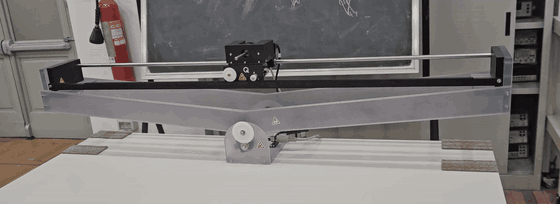
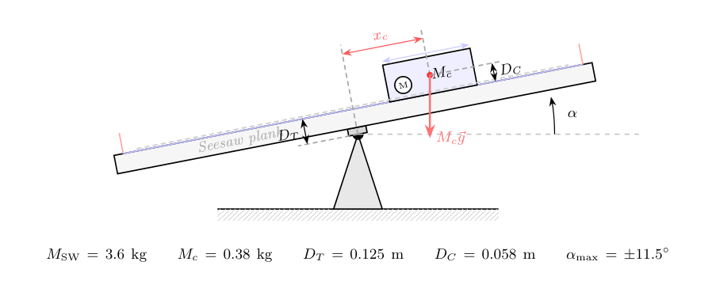
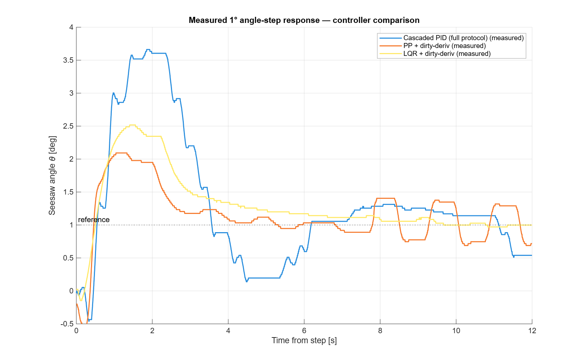
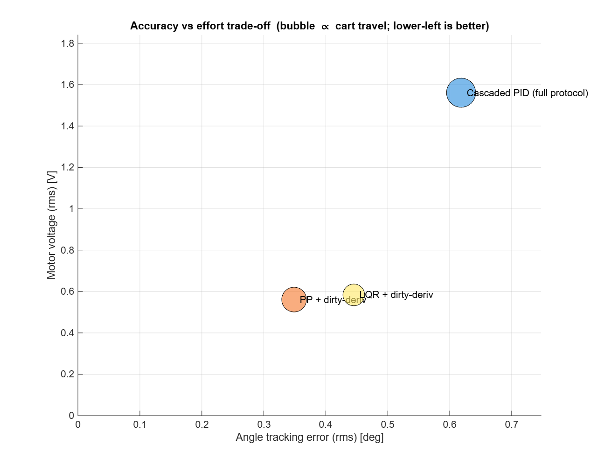

# Seesaw balancing on Quanser hardware

Modelling, identification and control of a Quanser IP02 cart mounted on a Seesaw-E module, built and tested on the real rig in the *Automation and Control Laboratory* course at Politecnico di Milano (2025/26).

The plant is hard to balance on purpose: one motor drives the cart, and the cart's position is the only way to tilt the beam. The linearised model has an unstable pole and a non-minimum-phase zero, the rack-and-pinion drive has asymmetric stiction, and the encoders are coarse. We designed three balancing controllers and compared them on the same hardware test protocol.

**Full report:** [docs/Seesaw_report.pdf](docs/Seesaw_report.pdf)



The rig in the lab under closed-loop control: the cart shifts along the beam to keep the seesaw level.



## Results on hardware

All three controllers ran on the rig through the same protocol: ±1° steps, a short pulse, and a stepped sine sweep from 0.1 to 10 Hz with amplitude tapering to keep rack forces safe.

| Metric | Cascaded PID | Pole placement | LQR / LQI |
|---|---|---|---|
| +1° step peak [deg] | 3.6 | **2.1** | 2.5 |
| Steady-state error [deg] | 0.06 | **0.01** | 0.02 |
| Swept-sine tracking error [deg RMS] | 0.52 | **0.33** | 0.42 |
| Free-run rocking [deg RMS] | 0.74 | **0.32** | 0.42 |
| Motor voltage [V RMS] | 1.56 | **0.56** | 0.58 |
| Cart travel [cm peak-to-peak] | 11.6 | 7.5 | **5.0** |

Pole placement gave the tightest tracking and regulation; LQR/LQI moved the cart least. All three overshoot more than the linear designs predict, mostly because of stiction, backlash and dirty-derivative phase lag. The report covers this gap in detail.





## What's in the repo

| Path | Contents |
|---|---|
| `scripts/config/seesaw_params.m` | Physical parameters and the linearised state-space model |
| `scripts/modeling/` | Cart and seesaw identification: step-response fit (`fminsearch`), multisine frequency response, quasi-static lift-off test, deadzone extraction |
| `scripts/control/` | Cart PID, cascaded PD/PID for the angle, pole placement with a Luenberger observer, LQR/LQI with a Kalman filter design, lift-up trajectory (CasADi + TV-LQR) |
| `scripts/analysis/` | Region-of-attraction estimates and model validation against hardware |
| `validation/` | Hardware test protocol generator and the metrics pipeline used for the comparison above |
| `models/` | Simulink / QUARC models |
| `data/` | Identification data, final hardware runs (`hardware_runs/`) and raw lab-session logs (`lab_sessions/`) |

## Team

Team Ctrl Z: Karim Negm, Kaipeng Hu, Nathan Zeep, Yawen Yan. Supervised by Prof. Fredy Ruiz and Andres Cordoba.

My part (Karim): the hardware validation protocol and metrics scripts (`validation/`), the pole-placement controller and Luenberger observer, and help with the LQR/LQI design.

## Running it

Requires MATLAB and Simulink. Hardware runs also need Quanser QUARC with the Q2-USB, VoltPAQ-X1, IP02 and Seesaw-E.

```matlab
>> seesaw_startup   % adds project folders to the path and loads parameters
```

Then run the scripts section by section. The lift-up script also needs [CasADi](https://web.casadi.org/get/) (tested with 3.7.2): unzip the MATLAB release into the project root and `seesaw_startup` adds it to the path.

Quanser's manuals and courseware are not included in this repo; they are available from Quanser.
